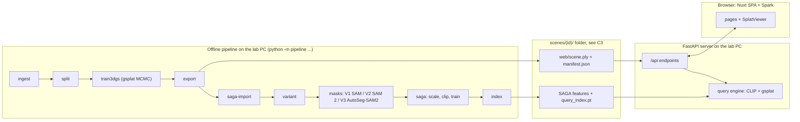
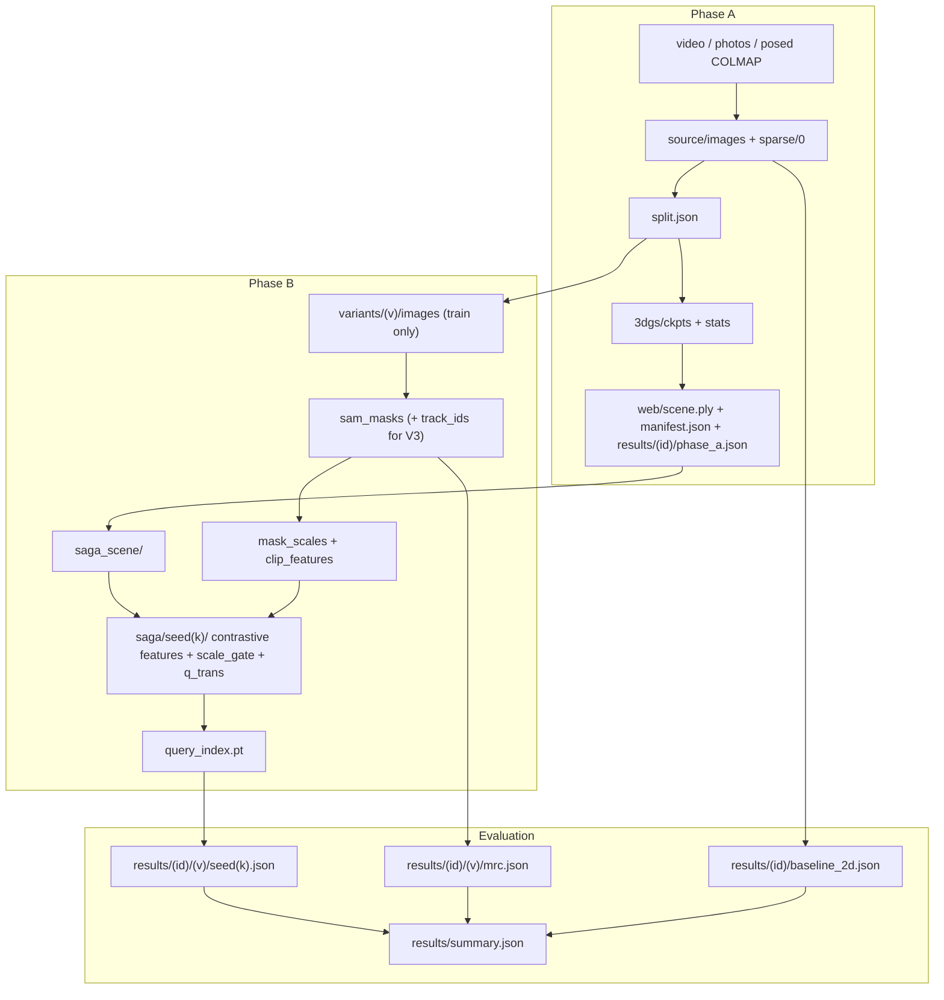

# 04 — Architecture and environments

## 1. The big picture



**Three separate things run at different times:**

1. **Offline pipeline** (CLI, hours, GPU-heavy):
   - Stages run **one at a time** and communicate only through files in `scenes/<id>/`.
   - Each stage is a Python function or an upstream script launched by `run_stage`, which logs time and VRAM.
2. **Server** (FastAPI, always on during demos):
   - Loads the CLIP text encoder once, and each scene's tensors on first use (keeps the last 2 (scene, variant, seed) sets in memory).
   - Answers queries in milliseconds and serves the built web app.
   - **Stop the server while training**, so the GPU memory is free.
3. **Browser** (Nuxt SPA + Spark):
   - Downloads the scene PLY once and renders it on the GPU (WebGL).
   - Only small JSON goes back and forth: a query in, one byte per Gaussian out (C12, C13).

## 2. Components

| Component | Folder | Responsibility | Talks to |
|---|---|---|---|
| CLI | `pipeline/cli.py` | parse commands (C16), call stage functions | stage modules |
| Stage modules | `pipeline/*.py` | one job each (ingest, split, train, export, masks, SAGA stages, index) | files in `scenes/`, upstream scripts through `run_stage` |
| Shared helpers | `pipeline/config.py`, `colmap_io.py`, `camera.py`, `plyio.py`, `render.py` | config, COLMAP reading, camera math (C10), PLY I/O, gsplat rendering | used by pipeline, server, evaluation |
| Server | `server/app.py`, `server/query.py` | HTTP API (C12), query engine (GPU or fake) | `scenes/`, `results/`, browser |
| Evaluation | `evaluation/*.py`, `experiments/run_matrix.py` | metrics, baseline, MRC, aggregation, run matrix | `scenes/`, `results/` |
| Web app | `web/` | pages, 3D viewer, query UI | server API |
| Forks | `third_party/*` | SAGA, gsplat trainer, AutoSeg-SAM2 | called as subprocesses (WRAP) or imported (gsplat library) |

## 3. Data flow per phase



## 4. Machines and the development loop

| Machine | Hardware | Used for |
|---|---|---|
| **Laptop** (Arch Linux) | i5-6200U, 7.7 GB RAM, Intel HD 520, **no CUDA**, **17 GB free disk** | editing code with a coding model; CPU unit tests; web UI development with the fixture scene and the fake engine |
| **GitHub** | `github.com/hasanfaesal/nvs` + 3 forks | syncing code between the machines |
| **Lab PC** | Windows 11, WSL2 Ubuntu, Intel i9, RTX A4000 16 GB, 1 TB NVMe | every GPU run; datasets; checkpoints; the demo |

```mermaid
sequenceDiagram
  participant U as You
  participant M as Coding model (laptop)
  participant G as GitHub
  participant P as Lab PC (WSL2 + GPU)
  U->>M: "Implement T-XXX" (prompt template, doc 10)
  M->>M: edit files, run the laptop check (pytest / npm run build)
  M->>G: git commit + push (and the fork branch, if a fork changed)
  U->>P: tmux: git pull --recurse-submodules; run the lab check
  P-->>U: output
  U->>M: paste the output if it fails; the model fixes it
```

Full details, templates and escalation rules are in `10-workflow-small-models.md`.

## 5. Laptop setup (T-002 creates the files; you run the script once)

```bash
cd ~/code3/gsp
bash scripts/setup_laptop.sh          # uv venv --python 3.10 .venv; CPU torch; env/laptop-requirements.txt
source .venv/bin/activate
pytest -q                             # all CPU tests
# web development (after T-A10):
cd web && npm install && npm run dev  # http://localhost:3000, proxies /api to :8000
# fake server (after T-A08/T-A09):
PS_FAKE=1 uvicorn server.app:app --reload --port 8000
```

- Never put datasets, checkpoints or real scenes on the laptop.
- To see a real scene from the laptop, open the lab server through Tailscale (§8).

## 6. Lab PC setup (T-003 is you; T-004 writes the scripts)

### 6.1 Windows side (once)

1. **NVIDIA driver:** an RTX/Quadro driver recent enough for CUDA 12.8 (R570 or newer). Inside WSL, `nvidia-smi` must print `CUDA Version: 12.8` or higher. **Do not install a Linux NVIDIA driver inside WSL.**
2. **`%UserProfile%\.wslconfig`** (then run `wsl --shutdown` in PowerShell):
   ```ini
   [wsl2]
   memory=24GB      # lab PC has 32 GB; leave room for Windows
   swap=16GB
   processors=12
   ```
3. **Power:** set sleep to *Never* while plugged in, and pause Windows Update during long runs. A reboot kills the WSL VM and every job in it.

### 6.2 WSL Ubuntu side (once)

```bash
sudo apt update && sudo apt install -y build-essential git tmux curl wget unzip
# CUDA toolkit for WSL (compiler only; the driver comes from Windows). VERIFY (T-003) the keyring file name on NVIDIA's site.
wget https://developer.download.nvidia.com/compute/cuda/repos/wsl-ubuntu/x86_64/cuda-keyring_1.1-1_all.deb
sudo dpkg -i cuda-keyring_1.1-1_all.deb && sudo apt update && sudo apt install -y cuda-toolkit-12-8
echo 'export PATH=/usr/local/cuda-12.8/bin:$PATH' >> ~/.bashrc
echo 'export LD_LIBRARY_PATH=/usr/local/cuda-12.8/lib64:$LD_LIBRARY_PATH' >> ~/.bashrc
# Miniforge (conda)
curl -L -O "https://github.com/conda-forge/miniforge/releases/latest/download/Miniforge3-$(uname)-$(uname -m).sh"
bash Miniforge3-$(uname)-$(uname -m).sh -b -p "$HOME/miniforge3" && "$HOME/miniforge3/bin/conda" init bash
# repo
gh auth login     # or set up an SSH key; needed if the repo is private
git clone --recurse-submodules https://github.com/hasanfaesal/nvs.git ~/nvs
cd ~/nvs && bash scripts/setup_lab.sh && bash scripts/download_checkpoints.sh
```

- **Keep everything on the WSL filesystem** (`~/nvs`), never under `/mnt/c`. The Windows filesystem is 10–50× slower from WSL.

### 6.3 Environments

| Env | Where | Contents | Created by |
|---|---|---|---|
| `ps` | lab (conda) | Python 3.10, PyTorch 2.9.1 + CUDA 12.8 wheels, gsplat (fork, editable, compiled), SAM 2 (git), segment-anything (git), open_clip_torch, pycolmap, hdbscan, scikit-learn, scipy, plyfile, opencv-python-headless, fastapi, uvicorn, gdown, pytest, ffmpeg, nodejs 22 | `env/lab.yml` + `scripts/setup_lab.sh` (T-004) |
| `colmap` | lab (conda) | COLMAP 4.2 CUDA build from conda-forge, kept separate so its CUDA libraries can't clash with PyTorch's | `scripts/setup_lab.sh` (T-004) |
| `saga` | lab (conda) | **only if the port fails**: Python 3.7, PyTorch 1.12.1, CUDA 11.6, SAGA's CUDA extensions, pytorch3d, scikit-learn | `env/saga-legacy.yml` (T-006) |
| `.venv` | laptop (uv) | Python 3.10, CPU PyTorch, numpy, opencv-python-headless, plyfile, pyyaml, fastapi, uvicorn, httpx, pytest, scikit-learn, scipy, pycolmap | `scripts/setup_laptop.sh` (T-002) |

- After T-004 succeeds, freeze the exact versions with `pip freeze > env/lab-lock.txt` and `conda env export -n colmap > env/colmap-lock.yml`, and commit both.
- Upstream SHAs go in `THIRD_PARTY.md` (T-001).

### 6.4 Version pins

| Component | Pin | Why |
|---|---|---|
| Python | 3.10 | widest compatibility (SAM 2 needs ≥ 3.10; gsplat wheels and old SAGA deps are happiest on 3.10) |
| PyTorch / torchvision | 2.9.1 / 0.24.1, CUDA 12.8 wheels | matches gsplat `examples/requirements.txt` on `main` |
| CUDA toolkit (nvcc) | 12.8 | must match the PyTorch CUDA version to compile gsplat and SAGA extensions |
| `TORCH_CUDA_ARCH_LIST` | `8.6` | the A4000 is Ampere sm_86; compiling for one arch only is much faster |
| gsplat | fork of `main` at the SHA in `THIRD_PARTY.md` | `main` uses the official `pycolmap` (v1.5.3 needs an old fork) |
| SAM 2 | SAM 2.1 checkpoints, git SHA pinned | `sam2.1_hiera_large.pt` |
| SAM v1 | `sam_vit_h_4b8939.pth` | SAGA's default |
| OpenCLIP | `ViT-B-16`, `laion2b_s34b_b88k` | SAGA's default CLIP |
| COLMAP | 4.2.0 CUDA (fallback 3.11) | GLOMAP built in as `global_mapper` |
| Spark / three.js | `@sparkjsdev/spark` 2.2.0 + the three.js version it requires | `package-lock.json` pins exact versions |
| Nuxt / Nuxt UI | 4.x / 4.x | from the starter template; `package-lock.json` pins them |

## 7. SAGA port plan (T-005) and fallback (T-006)

**Goal:** run SAGA inside `ps` (Python 3.10, PyTorch 2.9.1) so every stage shares one environment.

**Steps** (details in the T-005 card):
1. Delete the committed build artefacts.
2. Add `#include <cstdint>`.
3. Build the 4 CUDA extensions with `pip install --no-build-isolation`.
4. Replace the pytorch3d KNN.
5. Run SAGA's **own** pipeline on LERF-OVS `figurines`: `train_scene.py` (short) → masks → scale → CLIP → contrastive → one click query in a script.

**Success:** all steps run, peak VRAM < 14 GB, and the point query selects a sensible object.

**Timebox: 3 working days.** If it isn't working by then:
- run T-006 (legacy env);
- set `envs.saga: saga` in `configs/pipeline.yaml`. `run_stage` then prefixes SAGA commands with `conda run --no-capture-output -n saga`.

Nothing else changes, because all SAGA stages are subprocesses and exchange data only through files (C7, C8).

## 8. Networking

| Who | URL | How |
|---|---|---|
| Lab PC browser (Windows) | `http://localhost:8000` | the server in WSL binds `127.0.0.1:8000`; WSL2 forwards localhost to Windows |
| Your laptop / phone | `https://<lab-machine>.<tailnet>.ts.net` | in WSL: `sudo tailscale serve --bg 8000`. Tailnet devices only, over HTTPS; no public exposure. VERIFY (T-003) the exact `tailscale serve` syntax with `tailscale serve --help`. |
| SSH | `tailscale ssh <user>@<lab-machine>` | as you do now; run long jobs in `tmux new -s ps` |

There is no authentication: only your tailnet can reach the server (NFR-7).

## 9. GPU memory budget (A4000, 16 GB; target < 14 GB peak per stage)

| Stage | Expected peak | First knob if too high |
|---|---|---|
| COLMAP SIFT + matching (GPU) | 2–4 GB | `--FeatureExtraction.max_image_size 1600` |
| gsplat MCMC training, 1M Gaussians, ≈1000–1600 px images | 6–10 GB | `gsplat.cap_max` 1M → 700k |
| SAM v1 ViT-H automatic masks | 6–8 GB | `points_per_batch` 64 → 32 |
| SAM 2.1 Large automatic masks | 5–8 GB | `points_per_batch` 64 → 32 |
| AutoSeg-SAM2 tracking | 6–12 GB | `autoseg.batch_size` 40 → 20; `offload_state_to_cpu` |
| SAGA `get_scale.py` | 3–6 GB | – |
| SAGA CLIP features | 2–4 GB | – |
| SAGA contrastive training | 8–12 GB | `saga.num_sampled_rays` 1000 → 750 |
| Query index (features on GPU, HDBSCAN on CPU RAM) | 4–8 GB GPU, ≤ 8 GB RAM | `query_index.max_masks` |
| Server (CLIP text + one scene) | 2–4 GB | keep ≤ 2 scenes cached |

`peak_vram_mb` in C15 includes whatever else is on the GPU (Windows desktop, a browser). Compare `peak − baseline`.

## 10. Storage

| Where | Budget |
|---|---|
| Lab | envs ≈ 20 GB; checkpoints ≈ 4 GB; LERF-OVS ≈ 1 GB zipped, ≈ 2 GB unzipped; per processed scene ≈ 3–8 GB (3DGS ckpts, 5 variants × masks, 15 SAGA runs); total ≈ 100 GB of the 1 TB SSD |
| Laptop | `.venv` ≈ 1.5 GB (CPU torch), `web/node_modules` ≈ 0.5 GB, fixture scene ≤ 20 MB. **Stay under ~3 GB total.** |

## 11. Operating rules on the lab PC

1. **Always use tmux** for anything longer than a minute: `tmux new -s ps` / `tmux attach -t ps`.
2. **One GPU job at a time.** Stop the demo server before training.
3. Check `nvidia-smi` before starting a stage. Another user's process can make VRAM numbers meaningless.
4. Never delete `scenes/<id>/logs/stages.jsonl`; the systems table is built from it.
5. After every successful full run, commit `results/` from the lab: `git add results && git commit -m "results: <scene> <variant>" && git push`. Then pull on the laptop.
