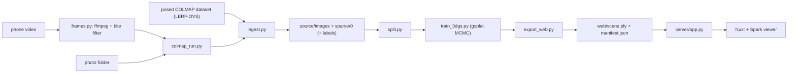

# 07 — Phase A: reconstruction and viewer

**Goal:** any of (a) a posed public dataset, (b) a phone video, or (c) a folder of photos becomes a Gaussian-splat scene that you can orbit in the browser at ≥ 30 FPS, with reconstruction metrics recorded.

**Exit gate:** T-A16 (checklist in §5). Requirements: FR-A1–FR-A11 in `03-requirements.md`.



---

## 1. Ingest (T-A02 posed; T-A15 video/images)

**Command** (C16): `python -m pipeline ingest --scene <id> (--colmap DIR | --images DIR | --video FILE) [--labels DIR] [--matcher sequential|exhaustive]`

### 1.1 Posed COLMAP input (LERF-OVS)
1. Check `DIR/images/` and `DIR/sparse/0/` exist. Some datasets put the model directly in `DIR/sparse/`; accept that and copy it into `sparse/0`.
2. Read the model with `pipeline/colmap_io.py`:
   - every camera must be `PINHOLE` or `SIMPLE_PINHOLE`, else stop with "run image_undistorter first";
   - every registered image name must exist in `DIR/images/`.
3. Copy (don't symlink, since the raw data may move) `images/` → `scenes/<id>/source/images/` and the model → `source/sparse/0/`.
4. If `--labels` is given, copy every `*.json` into `source/labels/`. LERF-OVS label folders also contain `.jpg` copies of the frames, which are not needed.
5. Print: number of images, camera model, image size, number of labels.

LERF-OVS facts, checked by reading the zip: 4 scenes; images ≈ 986×728, already undistorted; `sparse/0` uses PINHOLE; frames are named `frame_%05d.jpg` in capture order; labels are `label/<scene>/frame_XXXXX.json`.
- **VERIFY (T-007):** the exact top-level folder names after unzipping.
- **Known issue:** figurines has at least one mis-registered camera, whose position jumps about 42× the orbit radius. The split handles it (§4).

### 1.2 Video input
1. `frames.py` (§2) writes `source/input/frame_00001.jpg …`.
2. `colmap_run.py` (§3) with `matcher = sequential`.
3. The undistorted result lands in `source/images/` and `source/sparse/0/`.

### 1.3 Photo-folder input
1. Copy the photos to `source/input/`, sorted by name. If their size exceeds `frames.max_side`, resize them with OpenCV `INTER_AREA`.
2. `colmap_run.py` with `matcher = exhaustive` (unordered photos).

---

## 2. Frame extraction and blur filtering (T-A13, `pipeline/frames.py`)

Parameters come from `configs/pipeline.yaml` → `frames` (C6.1).

1. `ffmpeg -i VIDEO -vf fps=<extract_fps>,scale='if(gt(iw,ih),min(<max_side>,iw),-2)':'if(gt(iw,ih),-2,min(<max_side>,ih))' -q:v 2 TMP/%05d.jpg`. This oversamples at 6 fps and limits the long side to 1600 px.
2. **Sharpness** of each frame: `cv2.Laplacian(gray, cv2.CV_64F).var()`, computed on a copy downscaled to 640 px width, for speed.
3. **Window selection:** walk the frames in order in non-overlapping windows of `keep_every` (2) and keep the sharpest frame of each window. This gives ≈ 3 fps.
4. **Global rejection:** drop kept frames whose sharpness is < `min_sharpness_ratio` × median sharpness (0.3).
5. Re-encode the survivors with `cv2.imwrite(..., [cv2.IMWRITE_JPEG_QUALITY, 95])` as `frame_00001.jpg, frame_00002.jpg, …`, renumbered consecutively. SAM 2 needs this order later.
6. Print `extracted / kept / dropped_blur` and return the list of kept paths.

The pure logic (`select_sharp(sharpness: list[float], keep_every, min_ratio) -> list[int]`) is unit-tested on the laptop with synthetic numbers and with a synthetic video built by `cv2.VideoWriter`, in which some frames are blurred with `cv2.GaussianBlur`.

A 60–90 s video gives ≈ 180–270 frames, within the 60–300 range where COLMAP and SAM 2 behave well.

---

## 3. COLMAP (T-A14, `pipeline/colmap_run.py`)

**COPY + adapt** of SAGA's `convert.py` (identical to Inria 3DGS). COLMAP 4.x renamed the GPU options (`FeatureExtraction.*`, `FeatureMatching.*` since 3.13). The binary comes from `envs.colmap_bin`. Set `QT_QPA_PLATFORM=offscreen` in the environment (headless WSL).

```bash
S=scenes/<id>/source
colmap feature_extractor --database_path $S/distorted/database.db --image_path $S/input \
       --ImageReader.single_camera 1 --ImageReader.camera_model OPENCV --FeatureExtraction.use_gpu 1
colmap sequential_matcher --database_path $S/distorted/database.db --FeatureMatching.use_gpu 1      # video
#  or: colmap exhaustive_matcher --database_path $S/distorted/database.db --FeatureMatching.use_gpu 1   # photos
mkdir -p $S/distorted/sparse
colmap mapper --database_path $S/distorted/database.db --image_path $S/input --output_path $S/distorted/sparse \
       --Mapper.ba_global_function_tolerance=0.000001
#  fallback if < 80% of frames register:  colmap global_mapper (same --database_path/--image_path/--output_path)
colmap image_undistorter --image_path $S/input --input_path $S/distorted/sparse/<best> --output_path $S --output_type COLMAP
# image_undistorter writes $S/images and $S/sparse/*.bin; move the .bin files into $S/sparse/0/ (as convert.py does)
```

- **Best model:** the mapper may write `sparse/0`, `sparse/1`, …. Choose the one with the most registered images, read with `colmap_io`.
- **Registration check:** `registered / len(input)`:
  - < 0.8: retry once with `global_mapper`;
  - still < 0.8: stop with a message pointing to the capture protocol (§8).
- Each COLMAP command runs through `run_stage` (logs time + VRAM).
- **Compatibility check (lab, T-A14):** after the first real run, confirm that SAGA's `scene/colmap_loader.py` (`read_extrinsics_binary`, `read_intrinsics_binary`) reads the output. If it doesn't, pin `colmap=3.11` in the `colmap` env.

---

## 4. Split (T-A03, `pipeline/split.py`)

Algorithm, exactly as in C4:

```python
names = sorted(image names in source/images that are registered in sparse/0)
excluded = outlier_cameras(centers, names, factor=split.outlier_factor)   # C4
names = [n for n in names if n not in excluded]
annotated = {n for n in names if Path(n).stem + ".json" exists in source/labels}
test = {names[i] for i in range(len(names)) if i % every == 0} | annotated
train = [n for n in names if n not in test]
```

`outlier_cameras`:
- `med = median(centers, axis=0)`;
- `d = ‖centers − med‖`;
- a camera is an outlier if `d > factor × median(d)`.

Pure functions, unit-tested (`tests/test_split.py`).

---

## 5. 3DGS training with gsplat MCMC (T-A04 patch, T-A05 wrapper)

### 5.1 The fork patch (P-GS-1)

In `third_party/gsplat/examples/datasets/colmap.py`, `Dataset.__init__` selects `self.indices` with `indices % self.parser.test_every` (≈ `main` L458–462). Add an optional `split_file` parameter:

```python
if split_file is not None:
    names = json.load(open(split_file))[split]            # "train" or "test" (C4)
    pos = {n: i for i, n in enumerate(self.parser.image_names)}
    self.indices = np.array([pos[n] for n in names])       # KeyError = split and data disagree → crash loudly
else:
    ...  # original test_every code unchanged
```

In `examples/simple_trainer.py`:
- add `split_file: Optional[str] = None` to the `Config` dataclass;
- pass `split_file=cfg.split_file` to **both** `Dataset(...)` constructions (train and val).

`parser.image_names` must be the same strings as in `split.json` (file names with extension). VERIFY in the card with a print.

### 5.2 The wrapper (`pipeline/train_3dgs.py`)

```bash
cd third_party/gsplat/examples
python simple_trainer.py mcmc \
  --data_dir <abs scenes/<id>/source> --data_factor 1 --result_dir <abs scenes/<id>/3dgs> \
  --split_file <abs scenes/<id>/split.json> \
  --no-normalize-world-space \            # tyro bool flag; VERIFY exact spelling with --help (T-A05)
  --strategy.cap-max 1000000 --max_steps 30000 --lpips_net alex \
  --save_ply --disable_viewer
```

| Setting | Value | Why |
|---|---|---|
| `mcmc` | subcommand | MCMC preset (`init_opa=0.5`, `init_scale=0.1`, `opacity_reg=0.01`, `scale_reg=0.01`) |
| `data_factor` | 1 | images are already ≤ 1600 px (LERF-OVS ≈ 986 px) |
| `normalize_world_space` | **False** | the PLY must stay in COLMAP world coordinates (C10); otherwise SAGA and click queries are misaligned |
| `strategy.cap_max` | 1,000,000 | fixed budget: predictable VRAM (≈ 6–10 GB) and asset size (≈ 240 MB) |
| `antialiased` | False (default) | classic rasterization, same as SAGA's rasterizer |
| `app_opt`, bilateral grid | off (default) | the exported PLY keeps real SH colours |
| `sh_degree` | 3 (default) | SAGA's `load_ply` asserts 45 `f_rest` values |
| `lpips_net` | alex (default) | recorded in the manifest |

**Outputs**
- `3dgs/ckpts/ckpt_<step>_rank0.pt`: a dict with `step` and `splats` (`means`, `scales` (log), `quats` (wxyz), `opacities` (logit), `sh0` `[N,1,3]`, `shN` `[N,15,3]`);
- `3dgs/ply/point_cloud_<step>.ply`;
- `3dgs/stats/val_step<step>.json` (psnr, ssim, lpips, num_GS, …).
- **Never hardcode `<step>`.** Glob the files and take the largest step; files are named with the 0-based step, e.g. 29999.

**Time:** ≈ 20–40 min per LERF scene on the A4000. Run it in tmux.

---

## 6. Camera math and PLY helpers (T-A06)

`pipeline/camera.py` (pure numpy; formulas in C10):

```python
def colmap_viewmat(R: np.ndarray, t: np.ndarray) -> np.ndarray: ...          # 4x4 world->camera
def intrinsics(fx, fy, cx, cy, scale: float = 1.0) -> np.ndarray: ...          # 3x3
def initial_view(R, t, fy, height, points_xyz) -> dict: ...                    # C10.4 -> {position, target, up, fov_y_deg}
def threejs_to_viewmat(camera_matrix_world, mesh_matrix_world) -> np.ndarray: ...  # C10.5
def fit_render_size(width: int, height: int, max_side: int) -> tuple[int, int, float]: ...
def fov_intrinsics(fov_y_deg: float, w: int, h: int) -> np.ndarray: ...        # C10.5
def project(viewmat, K, xyz) -> np.ndarray: ...                                # helper for tests: [N,2] pixels
```

`pipeline/plyio.py` (uses plyfile):

```python
def read_vertex(path, fields: list[str] | None = None) -> dict[str, np.ndarray]: ...
def read_xyz(path) -> np.ndarray: ...                                          # [N,3] float32
def xyz_hash(xyz: np.ndarray) -> str: ...                                      # C11
def write_gaussians_ply(path, means, scales, quats, opacities, sh0, shN) -> None: ...  # Inria layout, used by the fixture and tests
```

---

## 7. Export (T-A07, `pipeline/export_web.py`)

1. Load the latest checkpoint's `splats` on the CPU.
2. **Neutralize bad rows** (C11). `bad = ~isfinite(...)` over every parameter of a row. For bad rows set:
   - `means = 0`, `scales = −10`, `quats = [1,0,0,0]`;
   - `opacities = −20` (invisible);
   - `sh0 = shN = 0`.
   Print the count.
3. `from gsplat import export_splats`; `export_splats(means, scales, quats, opacities, sh0, shN, format="ply", save_to=web/scene.ply)`.
4. **Verify:** read the PLY back with `plyio.read_xyz`. The row count must equal N, and the xyz must equal the checkpoint's `means` (`np.allclose`).
5. Write `web/manifest.json` (C5):
   - `num_gaussians`, `xyz_hash`, `asset.bytes`;
   - `initial_view` from the **first train camera** (`camera.initial_view` with the points3D of `sparse/0`);
   - metrics from the stats JSON;
   - `demo_queries` and `title` from `configs/scenes.yaml`;
   - `git_sha` (`git rev-parse --short HEAD`), `created_utc`.
6. Write `results/<id>/phase_a.json` (C14.1):
   - metrics;
   - `train_seconds` and `train_peak_vram_mb` from the `train_3dgs` line in `logs/stages.jsonl`;
   - `asset_mb`;
   - `fps_lab: null`.

---

## 8. Phone capture protocol (used by T-A16's test video and T-C01)

**Phone settings**
- **Lock** exposure and focus (AE/AF lock); turn off HDR, night mode and beauty filters.
- 1080p or 4K at 30 fps, landscape. Keep optical stabilization on, but turn off "super / action" electronic stabilization (it warps frames).

**Scene**
- **Static.** Nothing moves during the capture: no people, pets or fans.
- Matte objects, with a **textured background** (patterned cloth, newspaper, posters).
- Avoid mirrors, glass, screens and shiny metal.
- **Diffuse, stable light:** no direct sun, no flickering lamps.
- 8–12 distinct objects. For the second scene, add a few repeated categories (two mugs, three books) to make queries harder.

**Motion**
- A slow orbit, about 10 s per 90°.
- Do **two loops** at different heights (e.g. 30° and 60° looking down).
- Keep the object group always in view, with ≥ 70% overlap between moments; no fast turns.

**Length:** 60–90 s, which gives ≈ 180–270 frames after filtering. Record **two takes**.

**Check on the spot:** play the clip back and look for motion blur and exposure jumps. Recapture if needed. It's much cheaper than a failed COLMAP run.

---

## 9. Server, Phase A part (T-A08, `server/app.py`)

- `app = FastAPI()`. Config is loaded once through `pipeline.config.load_config()`.
- **Scene discovery:** every `scenes/*/web/manifest.json`. Build `{scene_id: Path}` at startup and on each `GET /api/scenes` call (cheap).
- **Endpoints** (C12): `/api/health`, `/api/scenes`, `/api/scenes/{scene_id}`, `/api/scenes/{scene_id}/asset`. The asset is sent with `FileResponse(..., media_type="application/octet-stream")`.
- **`variants` field:**
  - `[]` in Phase A;
  - in Phase B, it lists `variants/*` with `saga/seed*/query_index.pt`, i.e. `{"variant": v, "seeds": [...]}`.
- **Static web app:**
  - if `web/.output/public` exists, `app.mount("/", StaticFiles(directory=..., html=True))`, **after** all API routes;
  - SPA fallback: an exception handler for 404 on non-`/api` paths returns `web/.output/public/200.html`.
- **Run:**
  - lab: `uvicorn server.app:app --host 127.0.0.1 --port 8000`;
  - laptop: `PS_FAKE=1 uvicorn server.app:app --reload`.
- **Tests** (`tests/test_app.py`): FastAPI `TestClient` against a temp scenes dir made with the fixture writer.

## 10. Fixture scene (T-A09, `scripts/make_fixture_scene.py`)

This creates `scenes/_fixture/` so the whole web stack runs on the laptop:
- `web/scene.ply`: 30,000 Gaussians in 3 clusters, written with `plyio.write_gaussians_ply`. Positions are in the PLY/COLMAP frame, where y points **down**:
  - a red sphere centered at (−1, 0, 0), radius 0.5;
  - a green cube centered at (+1, 0, 0), side 0.8;
  - a grey floor plane at y = +0.6 (below the objects, because y points down);
- `web/manifest.json`: a valid C5 manifest with fake metrics. Its `initial_view` is given directly in **three.js world** coordinates (C10.4 output space): position (0, 1.5, 4), target (0, 0, 0), up (0, 1, 0), fov 50;
- `source/images/frame_0000{1..5}.jpg` (64×48 noise) and `split.json` (all 5 frames in train);
- `variants/{sam,sam2_frame,sam2_track_k10}/sam_masks/frame_0000{1..5}.pt` (random rectangles, C7), plus `track_ids/` for the track variant, plus an empty `saga/seed0/query_index.pt` marker, so the pseudo-label viewer and the variant list work.

Total size ≤ 20 MB. It is never committed (under `scenes/`); regenerate it with `python scripts/make_fixture_scene.py`.

## 11. Web app, Phase A part (T-A10, T-A11, T-A12)

### 11.1 Scaffold
- `npm create nuxt@latest web -- -t ui` (Nuxt UI starter; VERIFY the command in the Nuxt UI "Installation" docs).
- Then `cd web && npm install @sparkjsdev/spark three && npm install -D @types/three`.
- `nuxt.config.ts`:

```ts
export default defineNuxtConfig({
  ssr: false,                                   // SPA: WebGL only exists in the browser
  modules: ['@nuxt/ui'],
  css: ['~/assets/css/main.css'],               // from the template
  nitro: { devProxy: { '/api': { target: 'http://127.0.0.1:8000/api', changeOrigin: true } } },
  devtools: { enabled: false },
})
```

- Build for the server with `npx nuxi generate`. The output is `web/.output/public/` (with `200.html`), which FastAPI serves.

### 11.2 Pages

| Route | File | Phase A content |
|---|---|---|
| `/` | `app/pages/index.vue` | grid of `UCard`s from `GET /api/scenes`: title, Gaussian count (e.g. "1.0 M"), PSNR / SSIM / LPIPS, "Open" button → `/scene/<id>` |
| `/scene/:id` | `app/pages/scene/[id].vue` | full-height layout: `SplatViewer` on the left (flex-1), a 320 px side panel on the right with title, metrics, FPS, asset size, load progress, and a controls hint ("drag = orbit, right-drag = pan, wheel = zoom") |
| (Phase B) `/labels/:id`, `/results` | later cards | – |

`app/app.vue`: `<UApp>`, a header with links **Scenes** and **Results**, and `<NuxtPage/>`.

`app/composables/useApi.ts`: typed wrappers: `getScenes()`, `getScene(id)`, `assetUrl(id)` (`/api/scenes/${id}/asset`). Phase B adds the query functions.

### 11.3 `SplatViewer.client.vue` (COPY + adapt from Spark examples)

- **Props:** `assetUrl: string`, `initialView: {position, target, up, fov_y_deg}`, `meshQuaternion: [x,y,z,w]`.
- **Emits:**
  - `ready({ numSplats })`;
  - `progress(fraction)` (if Spark exposes load progress, else skip);
  - `pick({ u, v, width, height })` on a *click* (pointer moved < 4 px and < 300 ms). This is not a drag.
- **Expose (`defineExpose`):**
  - `getCameraState()` → `{ matrix_world: camera.matrixWorld.elements.slice(), fov_y_deg: camera.fov, width, height }`;
  - `getMeshMatrixWorld()` → `mesh.matrixWorld.elements.slice()`;
  - `getSplatMesh()` (for T-B14);
  - a reactive `fps`.
- **Setup:**
  - `THREE.WebGLRenderer({ canvas, antialias: false })`;
  - `THREE.PerspectiveCamera(fov, aspect, 0.01, 1000)`;
  - `scene.add(new SparkRenderer({ renderer, enableLod: false }))`;
  - `new SplatMesh({ url: assetUrl, enableLod: false })`, then `mesh.quaternion.set(...meshQuaternion)`, then `scene.add(mesh)`, then `await mesh.initialized`;
  - three.js `OrbitControls` (`three/addons/controls/OrbitControls.js`) with `target = initialView.target`;
  - `renderer.setAnimationLoop(() => { controls.update(); renderer.render(scene, camera) })`.
  - VERIFY (T-A11) the LoD option names against `examples/nonlod` at Spark 2.2.0.
- **Resize:** a `ResizeObserver` on the container calls `renderer.setSize(w, h, false)`, sets `camera.aspect = w / h`, then `camera.updateProjectionMatrix()`.
- **FPS:** a rolling mean of the frame intervals over the last 60 frames, updated twice per second.
- **Cleanup (`onBeforeUnmount`):** `renderer.setAnimationLoop(null)`, `controls.dispose()`, `mesh.dispose?.()`, `renderer.dispose()`.

---

## 12. Phase A exit gate (T-A16)

- [ ] All 4 LERF-OVS scenes: `source/`, `split.json`, `3dgs/` checkpoint + stats, `web/scene.ply` + `manifest.json`, `results/<id>/phase_a.json`.
- [ ] PSNR > 20 dB on every LERF scene. Record PSNR, SSIM and LPIPS.
- [ ] `peak_vram_mb − baseline_vram_mb` < 14,000 for every line in every `logs/stages.jsonl`.
- [ ] On the lab-PC browser, each scene loads in < 15 s and orbits at ≥ 30 FPS. Write the value into `fps_lab`.
- [ ] From the laptop over the tailnet, the scene list and one scene open (FPS best effort).
- [ ] One of your own phone videos goes through `ingest --video` → split → train → export → viewer.
- [ ] `pytest -q` passes on the laptop.
- [ ] Tag the commit: `git tag phase-a-done && git push --tags`.

## 13. Troubleshooting

| Symptom | Likely cause | Fix |
|---|---|---|
| gsplat CUDA build fails | `nvcc` version ≠ PyTorch's CUDA; wrong arch | `nvcc --version` must show 12.8; `export TORCH_CUDA_ARCH_LIST=8.6`; reinstall with `pip install -e third_party/gsplat --no-build-isolation -v` |
| gsplat `KeyError` on an image name | `split.json` names ≠ `parser.image_names` | print both; names must include the extension; re-run `split` after any re-ingest |
| COLMAP "No good initial image pair" | blur, low texture, too little overlap | recapture (§8); try `exhaustive_matcher`; try `global_mapper` |
| The scene looks upside down | mesh quaternion not applied | `mesh.quaternion.set(1,0,0,0)` from the manifest |
| The viewer shows nothing | wrong asset URL; the server isn't running | open the browser console; `curl -I localhost:8000/api/scenes/<id>/asset` |
| PSNR < 15 dB | trained on distorted images; wrong split; bad poses | check `source/images` is the **undistorted** output; check the split counts; look at the COLMAP registration % |
| OOM during training | too many Gaussians | `gsplat.cap_max: 700000`, then re-run |
| The tailnet URL doesn't load | `tailscale serve` not configured | `tailscale serve status`; re-run `sudo tailscale serve --bg 8000` |
