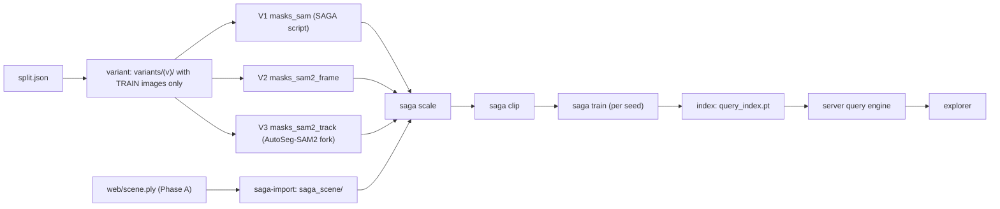

# 08 — Phase B: semantics, queries and the explorer

**Goal:** train SAGA affinity features on top of each Phase A scene from three mask sources (V1/V2/V3), answer text and click queries in milliseconds, and let the user explore and compare the variants in the browser.

**Exit gate:** T-B17 (§12). Requirements: FR-B1–FR-B15.



For **every scene**, the order is: `saga-import` once, then for each variant: `variant` → `masks` → `saga --stage scale` → `saga --stage clip` → for each seed: `saga --stage train` → `index`. `python -m pipeline all --scene S --variant V --seeds 0 1 2` runs the missing steps in this order (T-B08).

---

## 1. SAGA inside our project

- SAGA is **never imported** by our Python. Its scripts run as subprocesses through `run_stage` (WRAP), with `cwd=third_party/SegAnyGAussians`, because they import modules relative to the repo root.
- Every path we pass is **absolute**.
- `envs.saga: null` runs the scripts with the current Python (env `ps`, port succeeded). `envs.saga: saga` prefixes them with `conda run --no-capture-output -n saga` (T-006 fallback). This is the only switch.
- Fork patches needed before any Phase B run:
  - P-SAGA-1 (T-005 port);
  - P-SAGA-2 to P-SAGA-5 (T-B01).
  - Details in `05-codebase-map.md` §4.1.

## 2. Import and variant directories

### 2.1 `saga-import` (T-B02, C8)
1. `mkdir scenes/<id>/saga_scene/point_cloud/iteration_30000/`.
2. Copy `web/scene.ply` to `.../scene_point_cloud.ply`. It is the same file: gsplat's `export_splats` already writes Inria's attribute names (`x,y,z,f_dc_0..2,f_rest_0..44,opacity,scale_0..2,rot_0..3`), and SAGA reads fields by name. The copy (not a symlink) keeps SAGA from ever touching the web asset.
3. Check that the PLY has exactly 45 `f_rest_*` fields (SH degree 3); SAGA asserts this.

### 2.2 `variant` (T-B03, C3)
For a variant `v` and seeds `[k…]`:
1. `variants/v/images/<name>` → relative symlink to `../../../source/images/<name>`, for each `name` in `split.train` **only**.
2. `variants/v/sparse` → relative symlink to `../../source/sparse`.
3. For each seed k:
   - create `variants/v/saga/seed<k>/point_cloud/`;
   - link `iteration_30000` to `../../../../../saga_scene/point_cloud/iteration_30000` (compute it with `os.path.relpath`);
   - write `cfg_args` exactly as in C8.
4. It is idempotent: it recreates missing links and never deletes masks or features.

SAGA reads **all** cameras from `sparse/0`. Patch P-SAGA-2 makes it skip cameras whose image file is missing, so only train views load. It must print `skipped <n> cameras`, where n = test + excluded.

## 3. Mask sources

### 3.1 Fairness rules (identical for V1, V2, V3)

| Aspect | Rule |
|---|---|
| Frames | exactly `split.train`, through the variant dir |
| Input colour | RGB (P-SAGA-4 fixes upstream's BGR) |
| Segmentation resolution | full image resolution |
| Stored resolution | `(W//4, H//4)`, bilinear resize, `>= 0.5`, using **SAGA's resize code** (copied, never re-written) |
| AMG thresholds | C6.1 `masks.amg` for both SAM v1 and SAM 2 AMG: `points_per_side 32, pred_iou 0.88, stability 0.95, box_nms 0.7, crop_n_layers 0, min_mask_region_area 100` |
| Storage | CPU `torch.bool` `[M,h,w]` per frame, M may be 0 (C7) |
| Checkpoints | SAM v1 `vit_h`; SAM 2.1 `hiera_large` for **both** SAM 2 variants |

### 3.2 V1 `sam` (T-B04): WRAP

```bash
python extract_segment_everything_masks.py --image_root <abs variants/sam> \
  --sam_checkpoint_path <abs checkpoints/sam_vit_h_4b8939.pth> --sam_arch vit_h \
  --downsample 4 --downsample_type mask
```

Output: `variants/sam/sam_masks/<stem>.pt`. Expect about 20–150 masks per frame.

### 3.3 V2 `sam2_frame` (T-B05): COPY + adapt

`pipeline/masks_sam2_frame.py` is SAGA's `extract_segment_everything_masks.py` loop with the generator swapped:

```python
from sam2.build_sam import build_sam2
from sam2.automatic_mask_generator import SAM2AutomaticMaskGenerator
model = build_sam2(cfg.masks.sam2_cfg, ckpt, device="cuda", apply_postprocessing=False)   # as in sam2's AMG notebook
amg = SAM2AutomaticMaskGenerator(model, **cfg.masks.amg)   # same thresholds as V1
for name in sorted(os.listdir(variant/"images")):
    img = cv2.cvtColor(cv2.imread(path), cv2.COLOR_BGR2RGB)
    masks = [m["segmentation"] for m in amg.generate(img)]            # list of HxW bool
    stack = resize_masks_like_saga(masks, H // 4, W // 4)             # COPIED from SAGA
    torch.save(stack.cpu(), variant/"sam_masks"/f"{stem}.pt")
```

### 3.4 V3 `sam2_track_k<K>` (T-B06 fork patch, T-B07 wrapper)

**What AutoSeg-SAM2 does**, in plain language (its `auto-mask-batch.py`; VERIFY the details at T-B06 by reading the file):
1. It reads the frames as a video: a folder of JPEGs named `0.jpg, 1.jpg, …` in order.
2. On the first frame it runs **automatic mask generation** for one *level* of granularity, removes duplicates (`mask_nms`, `masks_update`), and registers every mask as an object in SAM 2's video predictor (`add_new_mask`, one object ID each).
3. It propagates all objects forward in **batches of objects** (`--batch_size`), which bounds GPU memory.
4. Every `--detect_stride` frames (**our K**), it checks how much of the image is *not* covered by any tracked mask. If the uncovered area grew by > 1% since the last keyframe, that frame becomes a new **keyframe**:
   - it runs automatic masks again;
   - `search_new_obj` adds only masks that are > 50% uncovered (and large enough) as **new** objects;
   - existing objects are re-prompted with their current masks, so they **keep their IDs**.
5. At the end, `get_video_segments(final_output=True)` propagates all objects forward **and backward** (`reverse=True`), so objects discovered late also get masks in earlier frames.
6. It saves per-frame stacked boolean masks as `.npy`.
   - VERIFY (T-B06): the exact file layout and whether the stack index equals the object ID.

**Our fork patch (P-AS-1, T-B06):**
- Add `--detector {sam1,sam2}`, default `sam1` (the upstream behaviour).
- With `sam2`, the automatic masks come from `SAM2AutomaticMaskGenerator` (C6.1 thresholds) instead of SAM v1, and the level logic is kept.
- **Decision rule:** if porting the level logic takes more than 1 working day, keep `sam1` and record this in `docs/spec/port-report.md`. The analysis then compares V3 to V1 for the tracking effect, with V2 reported alongside.

**Our wrapper (T-B07), `pipeline/masks_sam2_track.py`:**
1. Make `variants/<v>/autoseg_raw/frames/` with symlinks `00000.jpg, 00001.jpg, …` → the train images in sorted order. Convert to JPEG only if the source isn't JPEG. Save `frames.json` = the list of original names.
2. For each level in `autoseg.levels` (`large`, `middle`), run the fork (flags as in Segment-then-Splat's `autoseg.sh`; VERIFY the exact names at T-B06):
   `auto-mask-batch.py --video_path <frames> --output_dir <raw>/<level> --level <level> --detect_stride K --batch_size 40 --detector sam2 …checkpoint flags…`
3. Load all tracks and give each a global ID: `global_id = level_index * 10000 + local_object_id`.
4. **Deduplicate tracks** with Segment-then-Splat's `remove_overlapping_masks` (COPY, IoU > `autoseg.dedup_iou` = 0.5). When two tracks overlap that much, keep the larger one.
5. For each frame `t`:
   - collect the masks of surviving tracks present in that frame with area ≥ `min_mask_region_area`;
   - resize them with SAGA's resize code;
   - save `sam_masks/<stem>.pt` and `track_ids/<stem>.json` (`{"ids": [...]}`, same order).
6. Print per-level statistics: number of tracks, mean track length (frames), masks per frame.

**Expected behaviour on LERF-OVS:** frames are keyframes 6–15° apart, not 30 fps video, so tracks will be shorter than on real video. This is a finding to report, not a bug (see `01-reading-list.md` #16, #26).

## 4. SAGA stages (T-B08, `pipeline/saga_stages.py`)

| Stage | Command (cwd = SAGA root) | What it does | Output | Time |
|---|---|---|---|---|
| `scale` | `get_scale.py --image_root <variant> -m <variant>/saga/seed0` | renders depth for each train view, back-projects each mask's pixels to 3D, `scale = ‖2·std(points)‖` | `mask_scales/<stem>.pt` `[M]` | ~5 min |
| `clip` | `get_clip_features.py --image_root <variant>` | for each mask: black out the background, crop to the mask's box, resize to 224×224, OpenCLIP ViT-B/16 image embedding (fp16) | `clip_features/<stem>.pt` `[M,512]` | ~5–15 min |
| `train` | `train_contrastive_feature.py -m <variant>/saga/seed<k> -s <variant> --iterations 10000 --num_sampled_rays 1000 --seed k` | freezes the RGB Gaussians and learns 32-D features + the scale gate with the scale-aware contrastive loss | `point_cloud/iteration_10000/{contrastive_feature_point_cloud.ply, scale_gate.pt, q_trans.joblib}` | ~15–30 min |

- The scale and CLIP stages are **seed-independent**. Run them once per variant; the train stage runs once per seed.
- `get_scale.py` needs a model dir, and `seed0` has the imported scene.
- Skip-if-done checks:
  - `scale`: count of `mask_scales/*.pt` == count of `sam_masks/*.pt`;
  - `clip`: same with `clip_features`;
  - `train`: `scale_gate.pt` exists.

**SAGA's loss, briefly** (read `01-reading-list.md` #23 before touching it):
- Each iteration picks one training view.
- It renders the feature map F and samples ≈ 1,000 pixels inside masks.
- For each of several sampled scales s:
  - the gate `g(s)` reweights the features;
  - pixel pairs inside the same mask at that scale are positives, other pairs are negatives;
  - `corr = cos(normalize(F_p ⊙ g), normalize(F_q ⊙ g))`.
- `loss = mean(−w·corr)[pos] + mean(w·relu(corr))[neg] + rfn·(1 − mean‖F‖)²`.
- **All pairs come from the same view.**

## 5. Query index (T-B11, `pipeline/query_index.py`, C9)

COPY + adapt of SAGA `prompt_segmenting.ipynb` cells 41–50. **Inputs:**
- the seed dir: `pf` = `f_0..f_31` from `contrastive_feature_point_cloud.ply`, `scale_gate.pt`, `q_trans.joblib`;
- the scene PLY (Gaussian geometry for rendering);
- the variant's `sam_masks`, `mask_scales` and `clip_features`;
- the train cameras (`colmap_io`).

**Steps:**
1. Check the index invariant: the xyz of the contrastive PLY must equal the xyz of the scene PLY (`np.allclose`), and `xyz_hash` must equal the manifest's. Otherwise raise.
2. `pfn = normalize(pf)`, `[N,32]`, on the GPU.
3. **Anchors:** `rng = np.random.default_rng(seed)`; choose `round(anchor_frac · N)` indices without replacement → `A = pfn[anchors]`.
4. For each train frame (every frame, or every 2nd if the total masks exceed `max_masks`; record `frame_stride`):
   - render `F = render_features(pfn, viewmat, K/4, W//4, H//4)` → `[h,w,32]`, then normalize per pixel (`pipeline/render.py`);
   - for each mask m in the frame:
     - `g_m = gate(q_trans([[scale_m]]))` `[32]`;
     - `Fm = normalize(F ⊙ g_m)`;
     - `mask_feat_m = normalize(mean over mask pixels of Fm)`;
     - `identifier_m = (normalize(A ⊙ g_m) · mask_feat_m) > identifier_thresh (0.5)` → bool `[Na]`.
5. **Distance:** `D = 1 − IoU(identifier_a, identifier_b)` for all mask pairs:
   - compute it on the GPU in row chunks: `inter = I @ Iᵀ` (float16), `union = |a| + |b| − inter`;
   - move it to the CPU as float64 (T ≤ 20k gives ≤ 3.2 GB).
6. **Clusters:** `hdbscan.HDBSCAN(min_cluster_size=30, cluster_selection_epsilon=0.25, metric="precomputed").fit(D).labels_`.
7. `mask_clip = normalize(clip_features)` (fp16 → fp32 → normalize → fp16).
8. Save C9 and print: T, number of clusters, noise fraction, time.

## 6. Query engine (T-B12, `server/query.py`)

Both engines expose the same methods:

```python
class GpuEngine:
    def text_query(self, scene_id: str, variant: str, seed: int, text: str) -> QueryResult: ...
    def click_query(self, scene_id: str, variant: str, seed: int, cam: dict, mesh_matrix_world: list[float],
                    pixel: tuple[float, float], scale: float) -> QueryResult: ...
    def render_rgb(self, scene_id: str, cam: dict, mesh_matrix_world: list[float]) -> np.ndarray: ...   # HxWx3 uint8
class FakeEngine: ...   # same methods, CPU only (PS_FAKE=1 or no CUDA)

@dataclass
class QueryResult:
    scores_u8: np.ndarray        # uint8 [N]  (C13)
    default_threshold: float
    info: dict                   # kept_clusters / pixel_alpha
    latency_ms: float
```

**Loading.** On the first request for (scene, variant, seed), load and cache:
- the Gaussians (`render.load_gaussians(web/scene.ply)`);
- `pf`, the gate (`Linear(1,32)+Sigmoid` with the state dict loaded), `q_trans` (joblib);
- `query_index.pt`.

Assert the invariant (C11) at load. Keep an `OrderedDict` LRU of 2 entries. The CLIP model (`open_clip.create_model_and_transforms("ViT-B-16", pretrained="laion2b_s34b_b88k")`) is loaded once, on the GPU, in fp16.

### 6.1 Text query (copied SAGA logic, with the cluster fix)

```text
pos   = text embedding averaged over SAGA's 80 templates   (COPY clip_utils/__init__.py exactly)
negs  = embeddings of "object", "things", "stuff", "texture" (exactly as get_scores_with_template does)
score_m = min_j softmax(10 · [e_m·pos, e_m·neg_j])[0]         for every mask m (e_m = mask_clip[m])
S_c   = mean of score_m over masks in cluster c (c ≥ 0)
kept  = {c : S_c > 0.45}  or  {argmax_c S_c} if empty
for c in kept:
    m* = argmax_{m in c} score_m
    g  = gate(q_trans(mask_scale[m*]));  q = mask_feat[m*]
    sim_c = normalize(pf ⊙ g) · q          # [N]
sim = max over kept c of sim_c             # SAGA's notebook used only cluster index 0 — we take all kept
scores_u8 = round(clip((sim + 1) / 2, 0, 1) · 255);  default_threshold = query.text_threshold (0.925)
info.kept_clusters = [{cluster, score}]
```

Cache the text embeddings with `functools.lru_cache(maxsize=512)` keyed by the stripped, lower-cased text. Cache whole results keyed by (scene, variant, seed, text).

### 6.2 Click query (copied from `saga_gui.py fetch_data`)

```text
viewmat, (w, h, s) = camera.threejs_to_viewmat(...), camera.fit_render_size(W, H, query.render_max_side)
K = camera.fov_intrinsics(fov_y_deg, w, h);  (px, py) = pixel · s   (C10.5)
F, alpha = render.render_features(normalize(pf), viewmat, K, w, h)       # [h,w,32], [h,w]
if alpha[py, px] < 0.5: raise Background (→ HTTP 409)
g = gate([[scale]])            # the slider value IS the quantile, as in the GUI
f = normalize(normalize(F[py, px]) ⊙ g)
sim = normalize(pf ⊙ g) · f
scores_u8 as above;  default_threshold = query.click_threshold (0.875);  info.pixel_alpha = alpha[py, px]
```

### 6.3 Debug render
`render.render_rgb(gaussians, viewmat, K, w, h)` → PNG. Used by the alignment overlay (§9).

### 6.4 Fake engine (laptop)
- **Text:** `seed = int(sha1(text), 16) % 2**32`; pick a random Gaussian as the center; `sim = 1 − 2·clip(dist / (0.25·extent), 0, 1)`.
- **Click:** cast the ray from the C10.5 camera through the pixel. The center is the **first hit**: among Gaussians within `0.02·extent` of the ray and in front of the camera, the nearest to the camera. With no hit, raise `Background` (HTTP 409). Radius = `(0.1 + 0.9·scale) · 0.5 · extent`.
- **Render:** a numpy point splat of the Gaussian centers with their DC colours (sorted far to near) at the fitted size.

## 7. API additions (T-B13)

Exactly C12 rows marked T-B13.
- **Scores:** `base64.b64encode(result.scores_u8.tobytes()).decode()`.
- **Label overlays:**
  - read `sam_masks/<stem>.pt` (`map_location="cpu"`) and the source image; upscale the masks with nearest-neighbour;
  - colour: `hsv((id * 0.618034) % 1, 0.65, 0.95)`, where id is the track ID (V3) or the mask index (V1/V2);
  - paint the largest masks first at alpha 0.5, then draw the contours in white;
  - cache the PNG bytes in an LRU.
- **Validation** as in C12 and NFR-7.

## 8. Explorer UI, Phase B (T-B14, T-B15)

### 8.1 Side panel (top to bottom)

1. **Mask source** `USelect`: the variants from the API, labelled with the C2 display names; **Seed** `USelect`.
2. **Text query:** `UInput` + Search button; chips for `demo_queries` from the manifest.
3. **Click mode** `USwitch`; **Granularity** `USlider` (0.05–1.0, step 0.05, default `query.default_scale` 0.5), enabled only in click mode.
4. **Threshold** `USlider` (0.50–1.00, step 0.005). It resets to the response's `default_threshold` on every new query, and applies instantly on the client (no server call).
5. **Display mode** (radio buttons): Highlight · Isolate · Hide · Transparent · Recolor · Heatmap; a colour input (`<input type="color">`) for Recolor; a **Reset** button (show the original scene).
6. **Info:** the selected count (`#scores ≥ t`), latency, cached flag, kept clusters.
7. **History:** the last 10 queries (text, or "click (u, v) @ scale"), each storing its `Uint8Array` scores, threshold and mode. Clicking one re-applies it without a server call.
8. **Debug:** an "Alignment overlay" switch. It fetches `POST /debug/render` for the current camera and shows the PNG over the canvas at 50% opacity; a refresh button re-fetches it.

### 8.2 Behaviour
- **A new text query** calls the API, stores the result, resets the threshold, and applies the current mode.
- **A click** (only in click mode) takes `pick({u,v,width,height})` from `SplatViewer`, `getCameraState()` and `getMeshMatrixWorld()`, and calls the click API.
  - On 409, show a toast: "Clicked background, try on an object".
- **Changing the mask source or seed** re-runs the last query with the same text, or the same camera + pixel + scale for a click.
- **Mode, threshold and colour changes** call `applyMode(...)` throttled to one per animation frame.

### 8.3 Mode math (`app/utils/splatModes.ts`, pure, vitest-tested)
Inputs: the original `rgb` (Float32 3N, 0–1) and `alpha` (Float32 N), `scores` (Uint8 N), `t`, `mode`, `color`. A Gaussian is **selected** iff `scores[i] >= round(t·255)`.

| Mode | Selected | Not selected |
|---|---|---|
| none | original | original |
| highlight | `rgb = 0.4·orig + 0.6·(1.0, 0.8, 0.0)`, original alpha | `rgb = 0.5·orig`, original alpha |
| isolate | original | `alpha = 0` |
| hide | `alpha = 0` | original |
| transparent | original | `alpha = 0.15·orig` |
| recolor | `rgb = color`, original alpha | original |
| heatmap | every splat: `rgb = turbo(scores[i]/255)` (Turbo colormap, the published 5th-degree polynomial approximation, values clamped to [0,1]), original alpha | – |

### 8.4 Applying to Spark (`app/composables/useSplatEdits.ts`)
- **Primary:** copy the per-splat RGBA pattern from Spark `examples/splat-painter` (`mesh.splatRgba` + `mesh.updateGenerator()`).
- **Fallback:**
  1. `packedSplats.forEachSplat` once to cache `center`, `scales`, `quaternion`, `opacity` and `color` in typed arrays;
  2. for each changed splat, `setSplat(i, center, scales, quaternion, newOpacity, newColor)`;
  3. `packedSplats.needsUpdate = true`.
- VERIFY (T-B14) which API works in 2.2.0, and document it in the card's result section.
- **Target:** < 200 ms for 1M splats.

## 9. Pseudo-label viewer (T-B16, `/labels/:id`)

- A frame slider (0 … n−1), prev/next buttons, keyboard ←/→, and a play button (2 frames/s).
- 4 columns: **source image** | **V1** | **V2** | **V3** (`GET …/frames/{stem}/labels/{variant}`), for the variants present. The first `sam2_track_k*` found is V3; prefer `k10`.
- A caption explains what to look at: "V3 keeps each object's colour across frames (persistent track IDs); V1/V2 colours are per-frame indices".

## 10. Evaluation hooks
The evaluation (`09-experiments-and-evaluation.md`) reuses `GpuEngine.text_query` and `pipeline/render.py` directly (no HTTP). Keep them importable without starting FastAPI.

## 11. Stretch: cross-view contrastive term (T-S01, P-SAGA-6)

Only after T-B17.

1. Load `track_ids/<stem>.json` alongside the masks (V3 variants only).
2. Each iteration, besides SAGA's usual view i, pick a second train view j with `0 < |i − j| ≤ 3` in sequence order.
3. Render the features for both views.
4. Sample `P = num_sampled_rays / 2` pixels inside masks in each view. For each sampled pixel, find its **finest** containing mask (the smallest area); that gives its track ID `τ` and scale `s`.
5. For the pairs (p in i, q in j):
   - `g = gate(q_trans(s_p))`;
   - `corr = cos(normalize(F_i(p) ⊙ g), normalize(F_j(q) ⊙ g))`;
   - positive if `τ_p == τ_q`, else negative.
6. `L_x = mean(−corr)[pos] + mean(relu(corr))[neg]`.
7. `L = L_saga + λ·L_x`, with `--xview_weight λ` (default 0 = upstream; use 0.5).

Variant id: `sam2_track_k10_xview`. Seeds and settings are the same as V3.

## 12. Phase B exit gate (T-B17)

- [ ] All 4 LERF-OVS scenes × {`sam`, `sam2_frame`, `sam2_track_k10`} × seed 0 have `query_index.pt`.
- [ ] For each scene and each variant, 3 label categories were typed as text queries. Save screenshots to `docs/figures/phaseb/` and note which variants selected the right object.
- [ ] Click queries select objects, and the granularity slider changes part vs whole on at least one object.
- [ ] The alignment overlay matches the Spark view on every scene (within ~2 px).
- [ ] Latency: the benchmark snippet in the T-B17 card writes `results/<id>/latency.json` (C14.6). Medians are < 2 s.
- [ ] Every mode, recolor, history, variant/seed switching and the pseudo-label viewer work.
- [ ] Every stage's `peak − baseline` < 14 GB.
- [ ] `git tag phase-b-done && git push --tags`.

## 13. Troubleshooting

| Symptom | Likely cause | Fix |
|---|---|---|
| SAGA `AttributeError: ... feature_dim` | incomplete `cfg_args` | regenerate it with `variant` (C8 fields) |
| SAGA crashes loading masks of test views | P-SAGA-2 missing | apply T-B01 |
| `skipped N cameras` has the wrong N | the variant has the wrong images | re-run `variant --force`; compare with `split.json` |
| Laptop test: `RuntimeError: Attempting to deserialize object on a CUDA device` | a SAGA-written `.pt` loaded without `map_location` | always `torch.load(p, map_location="cpu")` |
| AutoSeg OOM | too many objects per batch | `autoseg.batch_size: 20` |
| HDBSCAN takes > 30 min | too many masks | lower `query_index.max_masks` (→ every 2nd frame) |
| A text query selects half the scene | a noise-like cluster kept | inspect `info.kept_clusters`; raise the threshold; it's a real failure case, so report it |
| A click selects the wrong object | camera conversion or pixel scaling | run `pytest tests/test_camera.py`; check the debug overlay; check CSS pixels vs `devicePixelRatio` |
| Overlay offset or scaled | aspect or FOV mismatch | the canvas CSS size must equal `camera.width/height` sent; `camera.aspect` updated on resize |
| Edits not visible in Spark | missing `needsUpdate` / `updateGenerator()` | see §8.4 |
