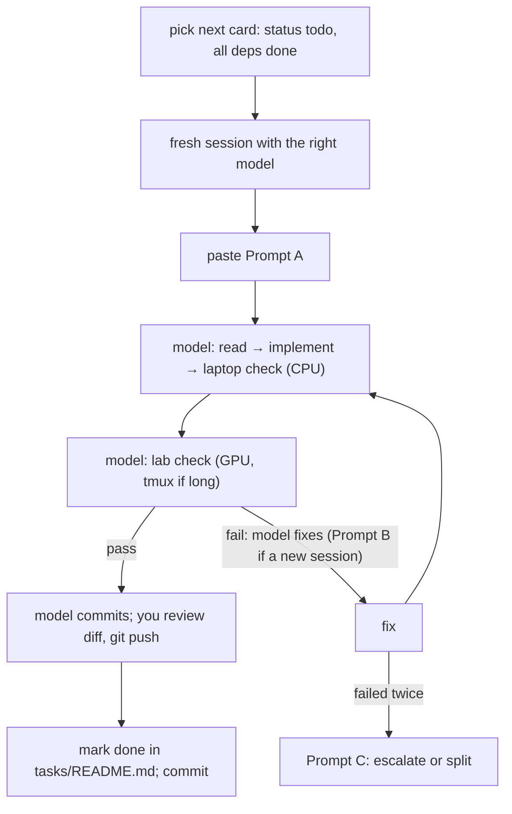

# 10 — Workflow: building PromptSplat with small coding models

The project is split into ~56 **task cards** (`docs/spec/tasks/`). Each card is small and self-contained enough for a small model (e.g. **Claude Haiku**) to implement in one session. This document is the operating manual: who does what, the loop for each card, copy-paste prompts, and how to recover when things go wrong.

---

## 1. Roles and tiers

| Role | Who | Does |
|---|---|---|
| **You** (lead) | human | pick cards, review diffs, `git push`, do the [H] cards (incl. full-size GPU runs) |
| **Implementer** | small model: Claude Haiku (`claude --model haiku`) or a small model in Cursor | [S] cards |
| **Senior** | stronger model: Claude Sonnet / Opus (`claude --model sonnet` / `--model opus`) or a larger model in Cursor | [M] cards, reviews, splitting stuck cards |

| Tier | Meaning | Rule |
|---|---|---|
| **[H]** | Only a human can do it: accounts, GUI, capture, long GPU runs, judgement | Follow the card's checklist yourself |
| **[S]** | Fully specified: ≤ 5 files to read, ≤ ~200 lines of code, deterministic checks | Small model; you review the diff |
| **[M]** | Subtle: CUDA builds, third-party internals, geometry, statistics | Stronger model, **or** small model + mandatory Prompt D review by a stronger model |

## 2. One-time setup

1. **Lab PC = where everything runs.** Do T-003 (it includes uv, Claude Code, `git`/`gh` auth) and T-004. Then in `~/nvs`: `bash scripts/setup_laptop.sh` (the CPU `.venv` for the fast checks; the name is historical).
2. **Connect from the laptop** (it's only a client now). `~/.ssh/config`:
   ```text
   Host lab
     HostName <lab-machine>        # the WSL node's Tailscale name (`tailscale status`)
     User <your WSL user>
   ```
   VS Code: *Remote-SSH: Connect to Host… → lab*, open `~/nvs`. Or plain `ssh lab` / `tailscale ssh`. Ports 3000/8000 are forwarded by VS Code automatically.
3. **Coding tool.** It must run on the lab PC at the repo root (`~/nvs`) so the rules load automatically:
   - Claude Code (`claude`, in the VS Code terminal or `tmux`) reads `CLAUDE.md`, which imports `AGENTS.md`;
   - Cursor (Remote-SSH works the same way) reads `.cursor/rules/promptsplat.mdc`, which points to `AGENTS.md`.
4. Put `docs/spec/tasks/README.md` (the status table) where you can see it; you update it after each card.

## 3. The loop (one card = one session)



**Step by step**
1. **Pick.** In `docs/spec/tasks/README.md`, take the first `todo` card whose dependencies are all `done`. Set it to `doing`.
2. **Fresh session.**
   - Claude Code: start `claude --model haiku` for [S] cards, or `--model sonnet` / `--model opus` for [M]. Use `/clear` between cards. One card per context keeps the small model focused.
   - Cursor: new chat, pick the model.
3. **Paste Prompt A** (§4) with the card ID.
4. **The model works** on the lab PC: it reads, implements, runs the **laptop check** (CPU, `.venv`) until green, then the **lab check** (GPU, `conda activate ps`, in `tmux` if it takes more than a minute) until green, and commits.
   If a card changed `third_party/gsplat` or the SAGA CUDA code, the model rebuilds it as the card says (e.g. `pip install -e third_party/gsplat --no-build-isolation`) before the lab check.
5. **You review:**
   - `git show --stat HEAD` → only the card's files changed?
   - skim `git show HEAD` for the reviewer checklist in §8, and the lab check output the model showed you.
   - Then `git push`. If a fork changed, the model already pushed the fork branch (AGENTS.md recipe). Check with `git submodule status`.
6. **Pass:** set the card to `done` in `tasks/README.md`. Optionally paste the key output lines into the card's "Result" section. Commit `[DOCS]: Record <what> lab check results`.
7. **Fail** (a check you ran yourself, e.g. in an [H] card, or the session ran out of context): give the output to a new session with **Prompt B**.
8. **Two failed fixes for the same card:** use **Prompt C** with a stronger model. It either fixes the problem or splits the card into smaller ones.

## 4. Prompts (copy-paste)

### Prompt A — implement a card
```text
You are implementing ONE task card in the PromptSplat repo.
1. Read AGENTS.md (repo root) completely.
2. Read docs/spec/tasks/<CARD-ID>*.md completely.
3. Read ONLY the files listed under "Read first" in the card. Do not explore unrelated parts of the repo.
4. Create/modify ONLY the files listed under "Files". Nothing else.
5. Follow the card's "Provenance": COPY upstream code where it says COPY (keep the Source header),
   WRAP where it says WRAP, write new code only where it says NEW.
6. Run the "Laptop check" commands (CPU, .venv); fix until they pass.
7. Run the "Lab check" commands (GPU, conda activate ps): check nvidia-smi first, use tmux if it takes > 1 minute;
   fix until they pass. Show me the final output of both checks.
8. Commit following AGENTS.md §7 (`[TAG]: <Imperative summary>`, no card id). If you changed a fork under third_party/,
   follow the submodule recipe in AGENTS.md exactly.
If the card is ambiguous, contradicts docs/spec/06-contracts.md, needs a file not listed,
or a check fails twice for the same reason: STOP, write the problem under "Blockers" in the card, and tell me.
```

### Prompt B — fix after a failed lab check
```text
The lab check for <CARD-ID> failed. Output:
<paste the full output>
Find the ROOT CAUSE (not the symptom). Fix it within the card's allowed files. Re-run the laptop check and the lab check,
commit "[FIX]: <What was fixed>" (AGENTS.md §7), and show both outputs.
If the fix needs a file outside the card's list or a contract change, stop and explain instead.
```

### Prompt C — escalate a stuck card (stronger model)
```text
A smaller model attempted <CARD-ID> and failed twice. Read AGENTS.md, the card, docs/spec/06-contracts.md,
and the attempts: `git log -p -- <the card's Files>` (commits carry no card id). Then either
(a) fix the implementation, or
(b) split the card into 2–3 smaller cards using docs/spec/tasks/_TEMPLATE.md and add them to tasks/README.md.
Say which you chose and why in 3 sentences, then do it.
```

### Prompt D — review (mandatory for [M] cards done by a small model)
```text
Review the commits for <CARD-ID> (`git log -p -- <the card's Files>`; commits carry no card id) against the card and docs/spec/06-contracts.md.
Check: paths and file formats (C3–C9, C14), camera conventions (C10), the Gaussian index invariant (C11),
API shapes (C12), provenance headers (05-codebase-map.md §5), no files outside scope, no new dependencies,
GPU imports inside functions, tests that would actually fail if the logic broke.
List concrete problems as file:line — problem — fix. Do not rewrite code unless I ask.
```

### Prompt E — write a new card
```text
Write a new task card docs/spec/tasks/<CARD-ID>-<slug>.md using docs/spec/tasks/_TEMPLATE.md for this goal: <goal>.
Keep it to ≤ 5 read-first files and ≤ ~200 lines of code; include a laptop check and a lab check;
cite 06-contracts.md sections and upstream sources precisely (repo, path, symbol). Add it to tasks/README.md.
```

## 5. Card statuses (column in `tasks/README.md`)

`todo` → `doing` → `review` ([M] cards waiting for Prompt D) → `lab` (waiting for your GPU check) → `done`. Or `blocked`, with a one-line reason and a link to the card's Blockers section.

## 6. Why modules stay importable without a GPU (fast CPU checks)

1. **Lazy GPU imports.** `import gsplat`, `sam2`, `segment_anything` and `open_clip`, and any CUDA work, happen **inside functions**, never at module top level. Every module can then be imported in the CPU `.venv`, so the fast checks never touch the GPU.
2. **Pure core, thin GPU shell.** Split logic into pure functions (numpy/torch-CPU) that tests exercise with synthetic data (split, camera math, mask resize, MRC warping, metrics, aggregation, mode math), and a thin function that calls the GPU library.
3. **Synthetic tests:** tiny arrays, temp dirs, fixture PLYs written by `plyio`. No downloads, no datasets.
4. **Fake engine:** `PS_FAKE=1` makes the server answer queries on the CPU, so the whole web UI can be built and clicked through without a trained scene.
5. **Smoke-sized lab checks:** each card's lab check uses small settings (e.g. `--max-steps 500`, 3 frames, 1 seed) and finishes in minutes. Full-size runs are separate [H] cards (T-A16, T-B09, T-E08).

## 7. Git conventions

- Commit messages: `[TAG]: <Imperative summary>`, e.g. `[ENH]: Add split builder`, `[FIX]: Fix <what>`. Full rules and tag list: `AGENTS.md` §7. No card ids in commits.
- **Never** force-push; never rewrite pushed history.
- **Never commit** `data/`, `scenes/`, `checkpoints/`, `*.pt`, `*.pth`, `*.ply`, `.venv/` or `node_modules/` (T-002 sets up `.gitignore`).
- Tags at the gates: `phase-a-done`, `phase-b-done`, `eval-done`.
- **Submodule recipe** (also in `AGENTS.md`), when a card changes a fork:
  ```bash
  cd third_party/<repo>
  git checkout promptsplat            # never commit on a detached HEAD
  git add <files> && git commit -m "[ENH]: <Summary>"
  git push origin promptsplat
  cd ../..
  git add third_party/<repo> && git commit -m "[DEP]: Bump <repo> fork"
  ```
  Then list the change in `05-codebase-map.md` §4 (patch registry) if it's a new patch.

## 8. Reviewer checklist (you or Prompt D)

- [ ] Only the card's files changed (`git show --stat`).
- [ ] Paths come from `pipeline/config.py`; nothing absolute is hardcoded (except in `cfg_args`, which must be absolute and built with `Path.resolve()`).
- [ ] Formats match `06-contracts.md` (dtypes, shapes, names, JSON keys).
- [ ] Camera math is imported from `pipeline/camera.py`, not re-derived.
- [ ] Nothing reorders, filters or drops Gaussians (C11).
- [ ] Every `torch.load` has `map_location="cpu"` unless the GPU is intended.
- [ ] COPY blocks have the `Source:` header and keep the upstream names.
- [ ] No new dependency unless the card allows it.
- [ ] The tests would fail if the logic were wrong (not just "runs without error").
- [ ] No thresholds or defaults silently changed (they live in `configs/pipeline.yaml`).

## 9. Size and context budget for a card

| Limit | Value | If exceeded |
|---|---|---|
| Files to read first | ≤ 5 (spec sections count as files) | split the card |
| New code | ≤ ~200 lines (tests excluded) | split the card |
| Files to create/modify | ≤ 4 | split the card |
| Session length | one card | `/clear` or a new chat per card |

## 10. When the upstream code differs from the docs (VERIFY items)

Some cards contain `VERIFY:` lines: facts checked on 2026-09-23 that must be re-confirmed at the pinned SHA (flag names, file layouts, line numbers).
- **If the fact holds:** carry on.
- **If it differs only in a local detail** (a line number, a flag spelling): adapt, and note it under "Findings" in the card.
- **If it changes a contract** (a format, a folder layout, an API): **stop** and write it under "Blockers". You or a senior model update `06-contracts.md` first (only cards that say "may edit 06-contracts.md" may do it), then continue.

## 11. Claude Code vs Cursor

| | Claude Code | Cursor |
|---|---|---|
| Rules | `CLAUDE.md` → `@AGENTS.md` (auto-loaded) | `.cursor/rules/promptsplat.mdc` (`alwaysApply: true`) → "read AGENTS.md" |
| Model per card | `claude --model haiku` / `sonnet` / `opus` | model picker in the chat |
| New context | `/clear` | new chat |
| Running checks | the model runs shell commands (approve them) | agent mode runs terminal commands |
