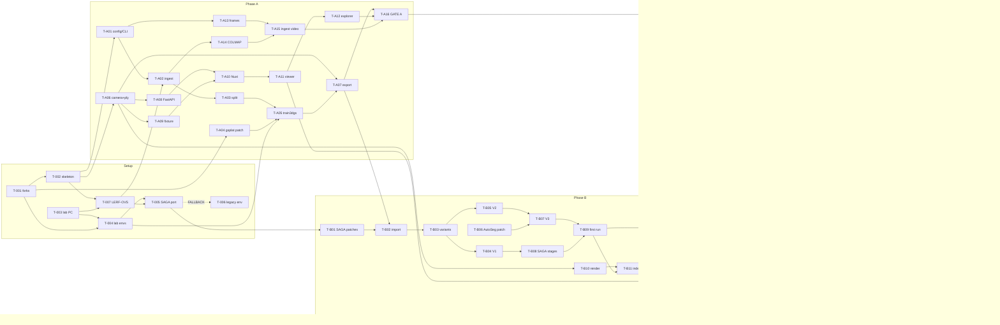

# Task cards: status, dependencies, suggested order

**How to use:**
- Pick the first `todo` card whose dependencies are all `done`.
- Follow the loop in `../10-workflow-small-models.md`: fresh session, then Prompt A, then the laptop check, then commit/push, then the lab check.
- Update the **Status** column here after each step, and commit.

Tiers: **[H]** you · **[S]** small model (e.g. Claude Haiku) · **[M]** stronger model, or a small model plus Prompt D review.

Statuses: `todo` → `doing` → `review` → `lab` → `done` · `blocked` (write the reason in the card).

## Status table

| ID | Title | Tier | Depends on | Status |
|---|---|---|---|---|
| T-001 | Fork upstream repos, submodules, THIRD_PARTY.md | H | – | lab |
| T-002 | Code skeleton, laptop env, test runner | S | T-001 | done |
| T-003 | Lab PC setup (WSL2, CUDA, conda, Tailscale) | H | – | todo |
| T-004 | Lab env files (conda `ps`, COLMAP env, checkpoints) | S | T-001, T-003 | lab |
| T-005 | SAGA port spike (timebox 3 days) | M | T-004, T-007 | todo |
| T-006 | Fallback legacy `saga` env (only if T-005 = FALLBACK) | S | T-005, T-A01 | todo |
| T-007 | Download LERF-OVS and check its layout | S/H | T-002, T-003 | lab |
| T-A01 | Config loader, CLI skeleton, `run_stage` | S | T-002 | todo |
| T-A02 | COLMAP reader + ingest posed datasets | S | T-A01, T-007 | todo |
| T-A03 | Split builder (`split.json`) | S | T-A02 | todo |
| T-A04 | gsplat fork patch: `split_file` | S | T-001 | todo |
| T-A05 | `train3dgs` wrapper (gsplat MCMC) | S | T-A03, T-A04, T-004 | todo |
| T-A06 | Camera math + PLY I/O | S | T-002 | todo |
| T-A07 | `export`: web PLY, manifest, phase_a.json | S | T-A05, T-A06 | todo |
| T-A08 | FastAPI Phase A + static web | S | T-A01, T-A06 | todo |
| T-A09 | Fixture scene for laptop dev | S | T-A06 | todo |
| T-A10 | Nuxt scaffold + scene list | S | T-A08, T-A09 | todo |
| T-A11 | `SplatViewer` (Spark) | S | T-A10 | todo |
| T-A12 | Explorer page, Phase A | S | T-A11 | todo |
| T-A13 | Frames + blur filter | S | T-A01 | todo |
| T-A14 | COLMAP runner | S | T-A01, T-A02, T-004 | todo |
| T-A15 | Ingest video / photos | S | T-A13, T-A14 | todo |
| T-A16 | **Phase A gate** | H | T-A07, T-A12, T-A15 | todo |
| T-B01 | SAGA fork functional patches | S | T-005 | todo |
| T-B02 | `saga-import` | S | T-A07, T-B01 | todo |
| T-B03 | Variant builder | S | T-B02, T-A03 | todo |
| T-B04 | V1 masks + dispatcher + checker | S | T-B03 | todo |
| T-B05 | V2 masks (SAM 2 per-frame) | S | T-B03 | todo |
| T-B06 | AutoSeg-SAM2 fork patch (`--detector sam2`) | M | T-001, T-004 | todo |
| T-B07 | V3 masks (tracking → SAGA format) | S | T-B05, T-B06 | todo |
| T-B08 | SAGA stage wrappers + `all` | S | T-B04 | todo |
| T-B09 | First full Phase B run (figurines) | H | T-B07, T-B08 | todo |
| T-B10 | Render helpers (`pipeline/render.py`) | S | T-A06, T-004 | todo |
| T-B11 | Query index precompute | M | T-B09, T-B10 | todo |
| T-B12 | Query engine (GPU + fake) | M | T-B11, T-A06 | todo |
| T-B13 | API, Phase B endpoints | S | T-B12, T-A08 | todo |
| T-B14 | Splat edit modes (+ vitest) | S | T-A11 | todo |
| T-B15 | Explorer query panel | S | T-B13, T-B14, T-A12 | todo |
| T-B16 | Pseudo-label viewer | S | T-B13, T-A10 | todo |
| T-B17 | **Phase B gate** | H | T-B15, T-B16 | todo |
| T-E01 | GT parsing (LERF-OVS + labelme) | S | T-002 | todo |
| T-E02 | Metrics (IoU, BIoU, localization) | S | T-002 | todo |
| T-E03 | 3D evaluation | S | T-B12, T-B10, T-E01, T-E02 | todo |
| T-E04 | 2D-only baseline | S | T-E01, T-E02, T-B12 | todo |
| T-E05 | MRC consistency metric | M | T-B10, T-B09 | todo |
| T-E06 | Aggregate → summary.json (+ Wilcoxon) | S | T-E03, T-002 | todo |
| T-E07 | Experiment runner | S | T-E03, T-E04, T-E05, T-B08, T-B11 | todo |
| T-E08 | **Full matrix run** (LERF-OVS) | H | T-E07, T-B17 | todo |
| T-E09 | Results page + results-file endpoint | S | T-E06, T-B13 | todo |
| T-C01 | Capture 2 custom scenes | H | T-A16 | todo |
| T-C02 | Ingest custom scenes + pick frames | H | T-C01, T-A15 | todo |
| T-C03 | Annotate with labelme | H | T-C02 | todo |
| T-C04 | Custom scenes through the matrix | H | T-C03, T-E08 | todo |
| T-S01 | Stretch: cross-view loss (V3x) | M | T-B17, T-B07 | todo |
| T-S02 | Stretch: SPZ assets (only if needed) | S | T-A16 | todo |
| T-F01 | Demo prep, backup video, reproducibility dry run | H | T-E09, T-C04 | todo |

## Dependency graph

## Suggested order for one person

1. **Setup:** T-001 → T-002 → T-003 → T-004 → T-007. Then **start T-005 (the SAGA port spike) early**: it's the biggest risk, and the GPU is otherwise idle while you build Phase A.
2. **Phase A core:** T-A01 → T-A06 (pure, laptop only) → T-A02 → T-A03 → T-A04 → T-A05 (smoke run).
3. **Phase A app:** T-A07 → T-A08 → T-A09 → T-A10 → T-A11 → T-A12.
4. **Video path:** T-A13 → T-A14 → T-A15. Then **T-A16 gate** (full training runs overnight).
5. **Filler work while the GPU runs:** T-E01, T-E02, T-B10, T-B14 (all pure / CPU-testable).
6. **Phase B pipeline:** T-B01 → T-B02 → T-B03 → T-B04 → T-B05 → T-B06 → T-B07 → T-B08 → **T-B09** (long run).
7. **Phase B queries and UI:** T-B11 → T-B12 → T-B13 → T-B15 → T-B16 → **T-B17 gate**.
8. **Evaluation:** T-E03 → T-E04 → T-E05 → T-E06 → T-E07 → **T-E08** (2–3 days of GPU). Meanwhile T-C01 → T-C02 → T-C03 and T-E09.
9. **Finish:** T-C04 → (optionally T-S01, T-S02) → T-F01.

## Milestones (tags)

| Tag | Set in | Means |
|---|---|---|
| `phase-a-done` | T-A16 | 4 LERF scenes reconstructed, measured and viewable in the browser; the video path works |
| `phase-b-done` | T-B17 | text and click queries work for every scene and variant; latency measured |
| `eval-done` | T-E08 | the full LERF-OVS matrix is evaluated; `summary.json` committed |
| `v1.0` | T-F01 | custom scenes included; the demo is rehearsed |
